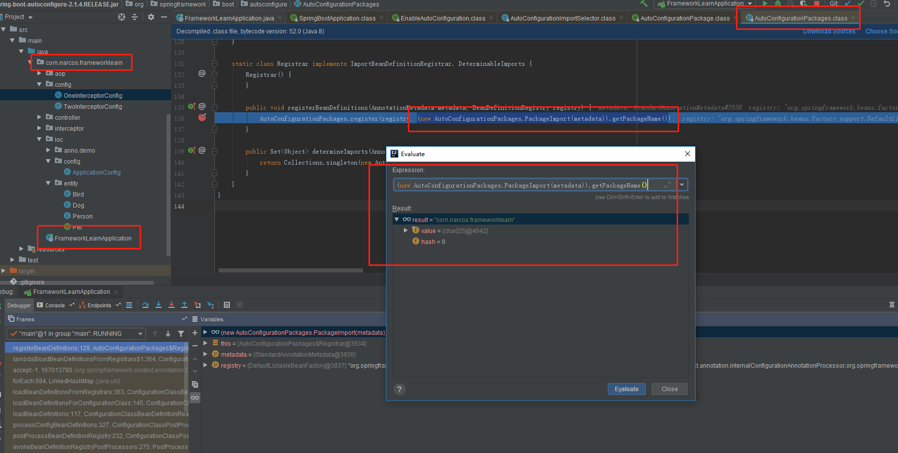

### SpringBoot 注解的介绍
#### 首先从启动类的 @SpringBootApplication 入手(会发现它的上面还有其它的注解)
```java
@Target({ElementType.TYPE})
@Retention(RetentionPolicy.RUNTIME)
@Documented
@Inherited
@SpringBootConfiguration
// 自动加载配置类
@EnableAutoConfiguration
@ComponentScan(
    excludeFilters = {@Filter(
    type = FilterType.CUSTOM,
    classes = {TypeExcludeFilter.class}
), @Filter(
    type = FilterType.CUSTOM,
    classes = {AutoConfigurationExcludeFilter.class}
)}
)
```
#### 针对问题分析：最近开发项目的时候，发现了不在启动类所在包下的@Configuration，@Controller等一系列的注解都不会被扫描到并生效。这是为什么呢？
###### 与SpringBoot的 @EnableAutoConfiguration 有关 下面对代码进行分析
```java
@Target({ElementType.TYPE})
@Retention(RetentionPolicy.RUNTIME)
@Documented
@Inherited
// 自动加载配置类
@AutoConfigurationPackage
@Import({AutoConfigurationImportSelector.class})
public @interface EnableAutoConfiguration {
    String ENABLED_OVERRIDE_PROPERTY = "spring.boot.enableautoconfiguration";

    Class<?>[] exclude() default {};

    String[] excludeName() default {};
}
```
```java
@Target({ElementType.TYPE})
@Retention(RetentionPolicy.RUNTIME)
@Documented
@Inherited
// 主要在这个Registrar
@Import({Registrar.class})
public @interface AutoConfigurationPackage {
}
```
```java
static class Registrar implements ImportBeanDefinitionRegistrar, DeterminableImports {
    Registrar() {
    }

    public void registerBeanDefinitions(AnnotationMetadata metadata, BeanDefinitionRegistry registry) {
        // 自动注册 它会扫描启动类所在包下的配置项
        AutoConfigurationPackages.register(registry, (new AutoConfigurationPackages.PackageImport(metadata)).getPackageName());
    }

    public Set<Object> determineImports(AnnotationMetadata metadata) {
        return Collections.singleton(new AutoConfigurationPackages.PackageImport(metadata));
    }
}
```

#####  然后它加载的配置都会有哪些呢 依旧对代码进行分析
```java
@Target({ElementType.TYPE})
@Retention(RetentionPolicy.RUNTIME)
@Documented
@Inherited
@AutoConfigurationPackage
// 主要是 AutoConfigurationImportSelector.class
@Import({AutoConfigurationImportSelector.class})
public @interface EnableAutoConfiguration {
    String ENABLED_OVERRIDE_PROPERTY = "spring.boot.enableautoconfiguration";

    Class<?>[] exclude() default {};

    String[] excludeName() default {};
}
```
```java
// AutoConfigurationImportSelector.class
protected AutoConfigurationImportSelector.AutoConfigurationEntry getAutoConfigurationEntry(AutoConfigurationMetadata autoConfigurationMetadata, AnnotationMetadata annotationMetadata) {
    if (!this.isEnabled(annotationMetadata)) {
        return EMPTY_ENTRY;
    } else {
        AnnotationAttributes attributes = this.getAttributes(annotationMetadata);
        // 加载 spring.factories 里面需要加载的东西
        List<String> configurations = this.getCandidateConfigurations(annotationMetadata, attributes);
        configurations = this.removeDuplicates(configurations);
        Set<String> exclusions = this.getExclusions(annotationMetadata, attributes);
        this.checkExcludedClasses(configurations, exclusions);
        // 排除一些本项目不需要的东西 只留下需要的配置
        configurations.removeAll(exclusions);
        configurations = this.filter(configurations, autoConfigurationMetadata);
        this.fireAutoConfigurationImportEvents(configurations, exclusions);
        return new AutoConfigurationImportSelector.AutoConfigurationEntry(configurations, exclusions);
    }
}
```
##### 例如SpringBoot spring-boot-autoconfigure jar包下的 spring.factories
##### 这里加载的是 SpringBoot 项目内嵌的一些模块 例如 tomcat，mongoDB,redis等等之类的东西
##### 然后通过AutoConfigurationImportSelector获得列表
##### 不需要的东西再从AutoConfigurationImportSelector的列表里面删除
##### 最后导入
```java
# Initializers
org.springframework.context.ApplicationContextInitializer=\
org.springframework.boot.autoconfigure.SharedMetadataReaderFactoryContextInitializer,\
org.springframework.boot.autoconfigure.logging.ConditionEvaluationReportLoggingListener

# Application Listeners
org.springframework.context.ApplicationListener=\
org.springframework.boot.autoconfigure.BackgroundPreinitializer

# Auto Configuration Import Listeners
org.springframework.boot.autoconfigure.AutoConfigurationImportListener=\
org.springframework.boot.autoconfigure.condition.ConditionEvaluationReportAutoConfigurationImportListener

# Auto Configuration Import Filters
org.springframework.boot.autoconfigure.AutoConfigurationImportFilter=\
org.springframework.boot.autoconfigure.condition.OnBeanCondition,\
org.springframework.boot.autoconfigure.condition.OnClassCondition,\
org.springframework.boot.autoconfigure.condition.OnWebApplicationCondition

# Auto Configure
org.springframework.boot.autoconfigure.EnableAutoConfiguration=\
org.springframework.boot.autoconfigure.admin.SpringApplicationAdminJmxAutoConfiguration,\
org.springframework.boot.autoconfigure.aop.AopAutoConfiguration,\
org.springframework.boot.autoconfigure.amqp.RabbitAutoConfiguration,\
org.springframework.boot.autoconfigure.batch.BatchAutoConfiguration,\
org.springframework.boot.autoconfigure.cache.CacheAutoConfiguration,\
org.springframework.boot.autoconfigure.cassandra.CassandraAutoConfiguration,\
org.springframework.boot.autoconfigure.cloud.CloudServiceConnectorsAutoConfiguration,\
org.springframework.boot.autoconfigure.context.ConfigurationPropertiesAutoConfiguration,\
org.springframework.boot.autoconfigure.context.MessageSourceAutoConfiguration,\
org.springframework.boot.autoconfigure.context.PropertyPlaceholderAutoConfiguration,\
org.springframework.boot.autoconfigure.couchbase.CouchbaseAutoConfiguration,\
org.springframework.boot.autoconfigure.dao.PersistenceExceptionTranslationAutoConfiguration,\
org.springframework.boot.autoconfigure.data.cassandra.CassandraDataAutoConfiguration,\
org.springframework.boot.autoconfigure.data.cassandra.CassandraReactiveDataAutoConfiguration,\
org.springframework.boot.autoconfigure.data.cassandra.CassandraReactiveRepositoriesAutoConfiguration,\
org.springframework.boot.autoconfigure.data.cassandra.CassandraRepositoriesAutoConfiguration,\
org.springframework.boot.autoconfigure.data.couchbase.CouchbaseDataAutoConfiguration,\
org.springframework.boot.autoconfigure.data.couchbase.CouchbaseReactiveDataAutoConfiguration,\
org.springframework.boot.autoconfigure.data.couchbase.CouchbaseReactiveRepositoriesAutoConfiguration,\
org.springframework.boot.autoconfigure.data.couchbase.CouchbaseRepositoriesAutoConfiguration,\
org.springframework.boot.autoconfigure.data.elasticsearch.ElasticsearchAutoConfiguration,\
org.springframework.boot.autoconfigure.data.elasticsearch.ElasticsearchDataAutoConfiguration,\
org.springframework.boot.autoconfigure.data.elasticsearch.ElasticsearchRepositoriesAutoConfiguration,\
org.springframework.boot.autoconfigure.data.jdbc.JdbcRepositoriesAutoConfiguration,\
org.springframework.boot.autoconfigure.data.jpa.JpaRepositoriesAutoConfiguration,\
org.springframework.boot.autoconfigure.data.ldap.LdapRepositoriesAutoConfiguration,\
org.springframework.boot.autoconfigure.data.mongo.MongoDataAutoConfiguration,\
org.springframework.boot.autoconfigure.data.mongo.MongoReactiveDataAutoConfiguration,\
org.springframework.boot.autoconfigure.data.mongo.MongoReactiveRepositoriesAutoConfiguration,\
org.springframework.boot.autoconfigure.data.mongo.MongoRepositoriesAutoConfiguration,\
org.springframework.boot.autoconfigure.data.neo4j.Neo4jDataAutoConfiguration,\
org.springframework.boot.autoconfigure.data.neo4j.Neo4jRepositoriesAutoConfiguration,\
org.springframework.boot.autoconfigure.data.solr.SolrRepositoriesAutoConfiguration,\
org.springframework.boot.autoconfigure.data.redis.RedisAutoConfiguration,\
org.springframework.boot.autoconfigure.data.redis.RedisReactiveAutoConfiguration,\
org.springframework.boot.autoconfigure.data.redis.RedisRepositoriesAutoConfiguration,\
org.springframework.boot.autoconfigure.data.rest.RepositoryRestMvcAutoConfiguration,\
org.springframework.boot.autoconfigure.data.web.SpringDataWebAutoConfiguration,\
org.springframework.boot.autoconfigure.elasticsearch.jest.JestAutoConfiguration,\
org.springframework.boot.autoconfigure.elasticsearch.rest.RestClientAutoConfiguration,\
org.springframework.boot.autoconfigure.flyway.FlywayAutoConfiguration,\
org.springframework.boot.autoconfigure.freemarker.FreeMarkerAutoConfiguration,\
org.springframework.boot.autoconfigure.gson.GsonAutoConfiguration,\
org.springframework.boot.autoconfigure.h2.H2ConsoleAutoConfiguration,\
org.springframework.boot.autoconfigure.hateoas.HypermediaAutoConfiguration,\
org.springframework.boot.autoconfigure.hazelcast.HazelcastAutoConfiguration,\
org.springframework.boot.autoconfigure.hazelcast.HazelcastJpaDependencyAutoConfiguration,\
org.springframework.boot.autoconfigure.http.HttpMessageConvertersAutoConfiguration,\
org.springframework.boot.autoconfigure.http.codec.CodecsAutoConfiguration,\
org.springframework.boot.autoconfigure.influx.InfluxDbAutoConfiguration,\
org.springframework.boot.autoconfigure.info.ProjectInfoAutoConfiguration,\
org.springframework.boot.autoconfigure.integration.IntegrationAutoConfiguration,\
org.springframework.boot.autoconfigure.jackson.JacksonAutoConfiguration,\
org.springframework.boot.autoconfigure.jdbc.DataSourceAutoConfiguration,\
org.springframework.boot.autoconfigure.jdbc.JdbcTemplateAutoConfiguration,\
org.springframework.boot.autoconfigure.jdbc.JndiDataSourceAutoConfiguration,\
org.springframework.boot.autoconfigure.jdbc.XADataSourceAutoConfiguration,\
org.springframework.boot.autoconfigure.jdbc.DataSourceTransactionManagerAutoConfiguration,\
org.springframework.boot.autoconfigure.jms.JmsAutoConfiguration,\
org.springframework.boot.autoconfigure.jmx.JmxAutoConfiguration,\
org.springframework.boot.autoconfigure.jms.JndiConnectionFactoryAutoConfiguration,\
org.springframework.boot.autoconfigure.jms.activemq.ActiveMQAutoConfiguration,\
org.springframework.boot.autoconfigure.jms.artemis.ArtemisAutoConfiguration,\
org.springframework.boot.autoconfigure.groovy.template.GroovyTemplateAutoConfiguration,\
org.springframework.boot.autoconfigure.jersey.JerseyAutoConfiguration,\
org.springframework.boot.autoconfigure.jooq.JooqAutoConfiguration,\
org.springframework.boot.autoconfigure.jsonb.JsonbAutoConfiguration,\
org.springframework.boot.autoconfigure.kafka.KafkaAutoConfiguration,\
org.springframework.boot.autoconfigure.ldap.embedded.EmbeddedLdapAutoConfiguration,\
org.springframework.boot.autoconfigure.ldap.LdapAutoConfiguration,\
org.springframework.boot.autoconfigure.liquibase.LiquibaseAutoConfiguration,\
org.springframework.boot.autoconfigure.mail.MailSenderAutoConfiguration,\
org.springframework.boot.autoconfigure.mail.MailSenderValidatorAutoConfiguration,\
org.springframework.boot.autoconfigure.mongo.embedded.EmbeddedMongoAutoConfiguration,\
org.springframework.boot.autoconfigure.mongo.MongoAutoConfiguration,\
org.springframework.boot.autoconfigure.mongo.MongoReactiveAutoConfiguration,\
org.springframework.boot.autoconfigure.mustache.MustacheAutoConfiguration,\
org.springframework.boot.autoconfigure.orm.jpa.HibernateJpaAutoConfiguration,\
org.springframework.boot.autoconfigure.quartz.QuartzAutoConfiguration,\
org.springframework.boot.autoconfigure.reactor.core.ReactorCoreAutoConfiguration,\
org.springframework.boot.autoconfigure.security.servlet.SecurityAutoConfiguration,\
org.springframework.boot.autoconfigure.security.servlet.SecurityRequestMatcherProviderAutoConfiguration,\
org.springframework.boot.autoconfigure.security.servlet.UserDetailsServiceAutoConfiguration,\
org.springframework.boot.autoconfigure.security.servlet.SecurityFilterAutoConfiguration,\
org.springframework.boot.autoconfigure.security.reactive.ReactiveSecurityAutoConfiguration,\
org.springframework.boot.autoconfigure.security.reactive.ReactiveUserDetailsServiceAutoConfiguration,\
org.springframework.boot.autoconfigure.sendgrid.SendGridAutoConfiguration,\
org.springframework.boot.autoconfigure.session.SessionAutoConfiguration,\
org.springframework.boot.autoconfigure.security.oauth2.client.servlet.OAuth2ClientAutoConfiguration,\
org.springframework.boot.autoconfigure.security.oauth2.client.reactive.ReactiveOAuth2ClientAutoConfiguration,\
org.springframework.boot.autoconfigure.security.oauth2.resource.servlet.OAuth2ResourceServerAutoConfiguration,\
org.springframework.boot.autoconfigure.security.oauth2.resource.reactive.ReactiveOAuth2ResourceServerAutoConfiguration,\
org.springframework.boot.autoconfigure.solr.SolrAutoConfiguration,\
org.springframework.boot.autoconfigure.task.TaskExecutionAutoConfiguration,\
org.springframework.boot.autoconfigure.task.TaskSchedulingAutoConfiguration,\
org.springframework.boot.autoconfigure.thymeleaf.ThymeleafAutoConfiguration,\
org.springframework.boot.autoconfigure.transaction.TransactionAutoConfiguration,\
org.springframework.boot.autoconfigure.transaction.jta.JtaAutoConfiguration,\
org.springframework.boot.autoconfigure.validation.ValidationAutoConfiguration,\
org.springframework.boot.autoconfigure.web.client.RestTemplateAutoConfiguration,\
org.springframework.boot.autoconfigure.web.embedded.EmbeddedWebServerFactoryCustomizerAutoConfiguration,\
org.springframework.boot.autoconfigure.web.reactive.HttpHandlerAutoConfiguration,\
org.springframework.boot.autoconfigure.web.reactive.ReactiveWebServerFactoryAutoConfiguration,\
org.springframework.boot.autoconfigure.web.reactive.WebFluxAutoConfiguration,\
org.springframework.boot.autoconfigure.web.reactive.error.ErrorWebFluxAutoConfiguration,\
org.springframework.boot.autoconfigure.web.reactive.function.client.ClientHttpConnectorAutoConfiguration,\
org.springframework.boot.autoconfigure.web.reactive.function.client.WebClientAutoConfiguration,\
org.springframework.boot.autoconfigure.web.servlet.DispatcherServletAutoConfiguration,\
org.springframework.boot.autoconfigure.web.servlet.ServletWebServerFactoryAutoConfiguration,\
org.springframework.boot.autoconfigure.web.servlet.error.ErrorMvcAutoConfiguration,\
org.springframework.boot.autoconfigure.web.servlet.HttpEncodingAutoConfiguration,\
org.springframework.boot.autoconfigure.web.servlet.MultipartAutoConfiguration,\
org.springframework.boot.autoconfigure.web.servlet.WebMvcAutoConfiguration,\
org.springframework.boot.autoconfigure.websocket.reactive.WebSocketReactiveAutoConfiguration,\
org.springframework.boot.autoconfigure.websocket.servlet.WebSocketServletAutoConfiguration,\
org.springframework.boot.autoconfigure.websocket.servlet.WebSocketMessagingAutoConfiguration,\
org.springframework.boot.autoconfigure.webservices.WebServicesAutoConfiguration,\
org.springframework.boot.autoconfigure.webservices.client.WebServiceTemplateAutoConfiguration

# Failure analyzers
org.springframework.boot.diagnostics.FailureAnalyzer=\
org.springframework.boot.autoconfigure.diagnostics.analyzer.NoSuchBeanDefinitionFailureAnalyzer,\
org.springframework.boot.autoconfigure.jdbc.DataSourceBeanCreationFailureAnalyzer,\
org.springframework.boot.autoconfigure.jdbc.HikariDriverConfigurationFailureAnalyzer,\
org.springframework.boot.autoconfigure.session.NonUniqueSessionRepositoryFailureAnalyzer

# Template availability providers
org.springframework.boot.autoconfigure.template.TemplateAvailabilityProvider=\
org.springframework.boot.autoconfigure.freemarker.FreeMarkerTemplateAvailabilityProvider,\
org.springframework.boot.autoconfigure.mustache.MustacheTemplateAvailabilityProvider,\
org.springframework.boot.autoconfigure.groovy.template.GroovyTemplateAvailabilityProvider,\
org.springframework.boot.autoconfigure.thymeleaf.ThymeleafTemplateAvailabilityProvider,\
org.springframework.boot.autoconfigure.web.servlet.JspTemplateAvailabilityProvider
```
##### 关于如何自定义配置等之后补上