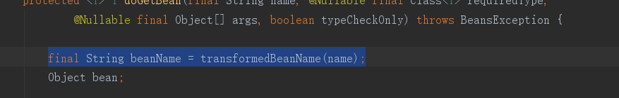
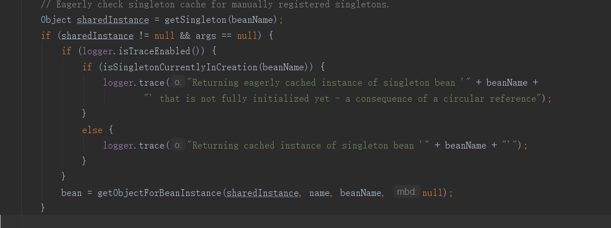
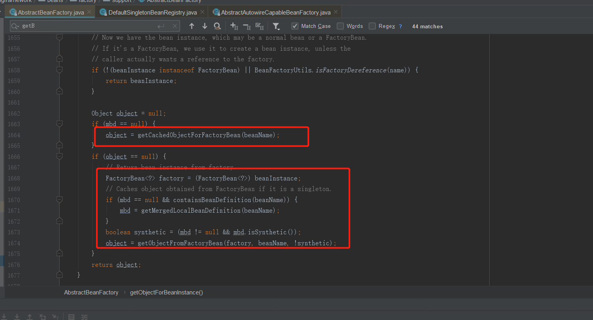
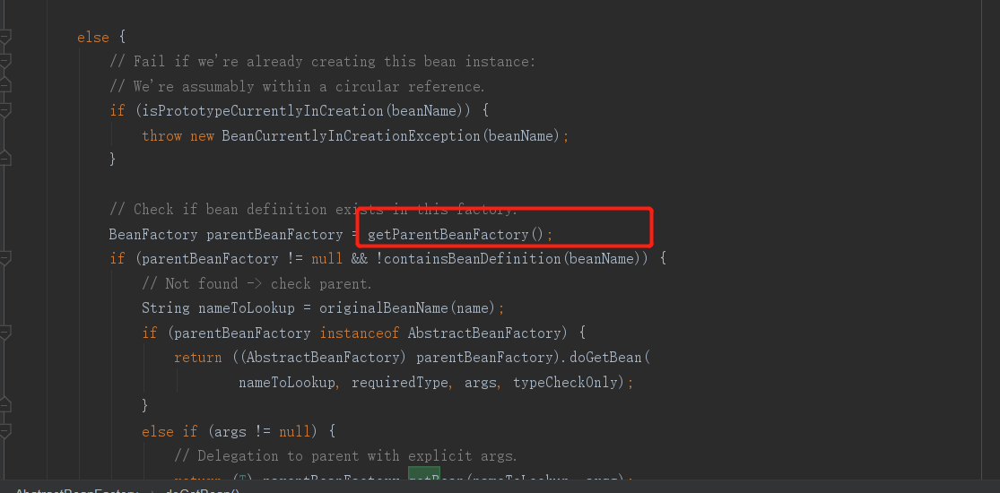
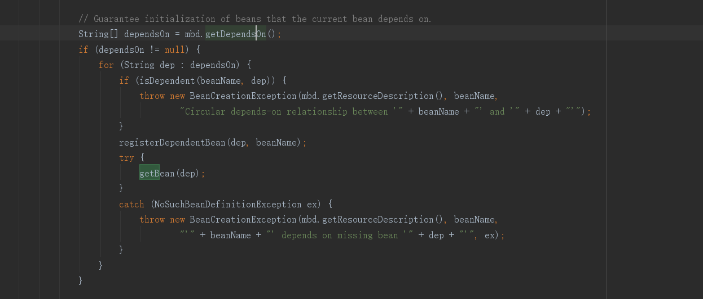
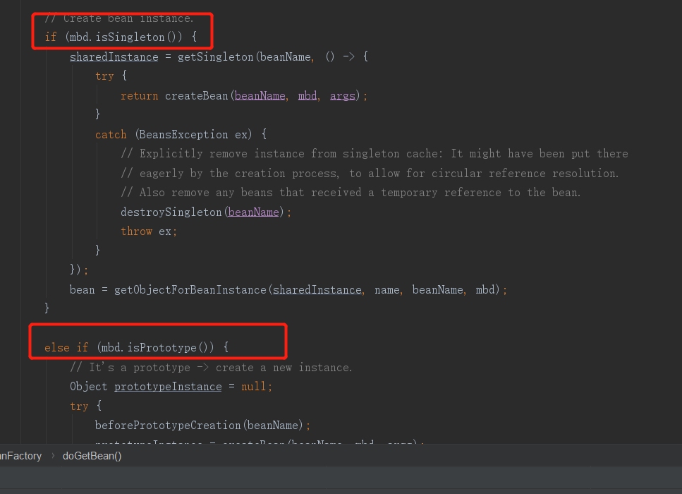
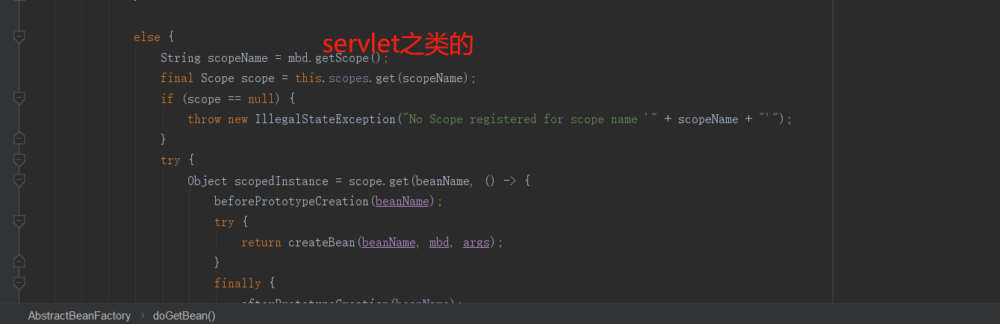
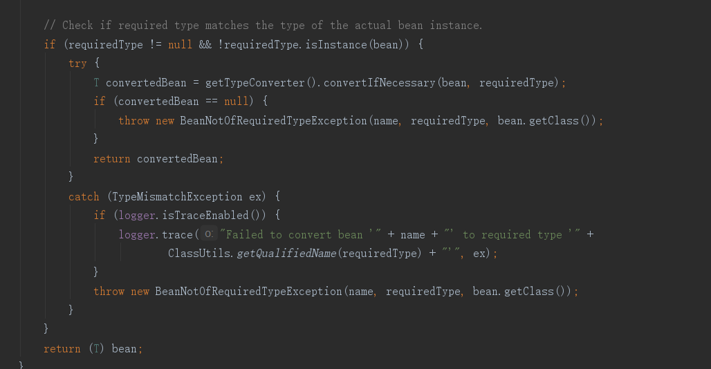
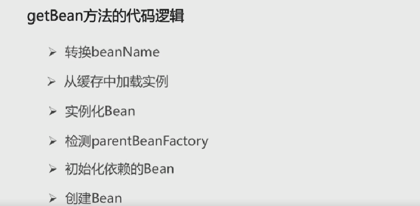

# GetBean 方法解析
### 方法：AbstractBeanFactory的doGetBean方法：
##### 1.转化bean的名称	

##### 2.通过getSingleton获取实例
#####   * 获取到的话 则取获取对应的bean实例（获取方法：从缓存中获取或者从bean工厂中获取）

#####   * 获取不到则从ParentBeanFactory中获取

##### 3.获取bean的定义（递归）

##### 4.检查bean的作用域 来决定创建bean的情况

##### 5.检验创建的bean类型是否符合需要的实例 是的话就返回

##### getBean 全流程
